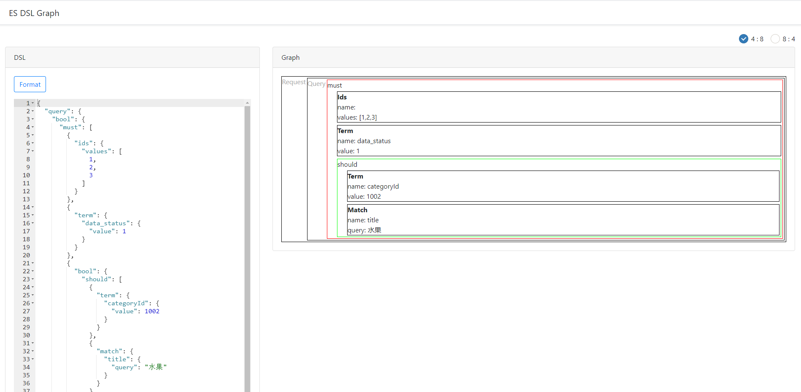

# es-dsl-graph
ElasticSerch DSL Graph

## 安装步骤(共2步)
步骤1. mvn install
```xml
<dependency>
    <groupId>cn.canos</groupId>
    <artifactId>es-dsl-graph</artifactId>
    <version>1.0.0</version>
</dependency>
```

步骤2. 配置Servlet，添加@ServletComponentScan (仅SpringBoot需要配置，SpringMvc不需要配置)

```
@ServletComponentScan(basePackages = "cn.canos.esdslgraph")
@SpringBootApplication
public class App {

    public static void main(String[] args) {

        SpringApplication.run(App.class, args);
    }
}
```

## 验证安装

在浏览器中打开 `http://localhost:8080/es-dsl-graph` 或`http://localhost:8080/tomcat-based-app/es-dsl-graph`，若页面正常显示，则安装完成。

# 示例

## 使用截图

